# Metoda analizy hierarchii Saaty’ego #

Celem projektu było stworzenie aplikacji, która by w prosty sposób pozwalała użytkowników użyć metody analizy hierarchii Saaty’ego. Model został opracowany przez T. Satty’ego w 1997 roku. Ma on za zadanie wspomóc proces decyzyjny, w którym zachodzi podjęcie decyzji z wykorzystaniem wielu kryteriów.

## Przebieg działania programu ##
### Ekran startowy ###
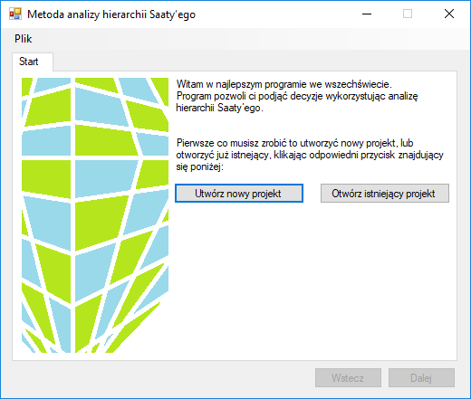
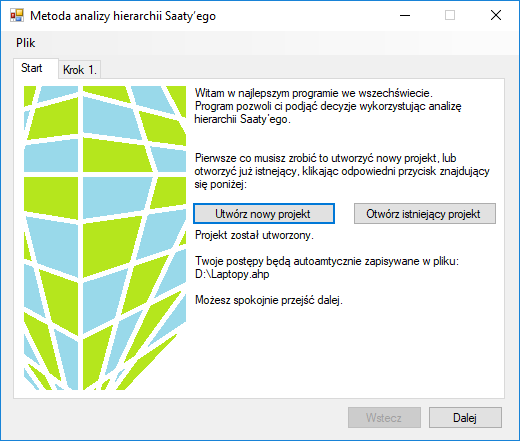
### Ekran edycji kryteriów ###
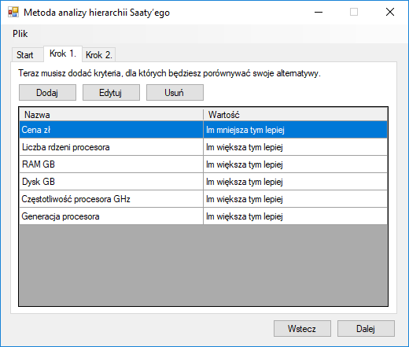
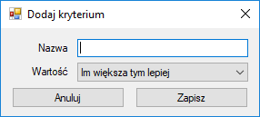
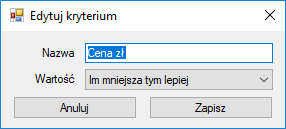
### Ekran wag kryteriów ###
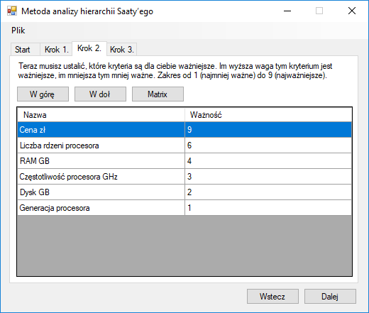
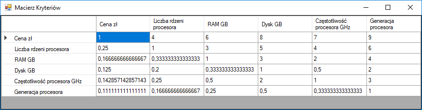
### Ekran edycji alternatyw ###
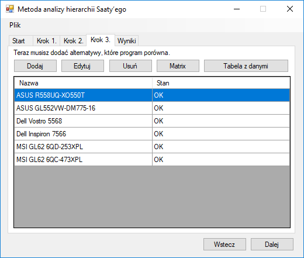
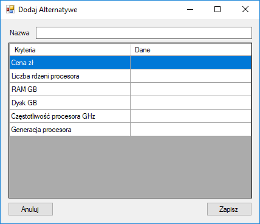
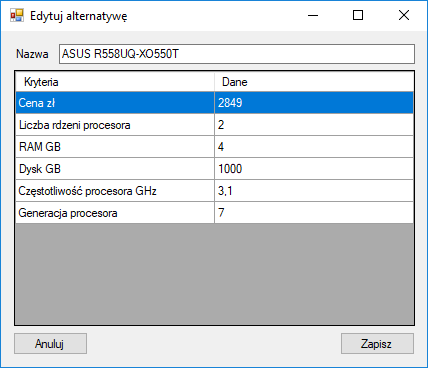
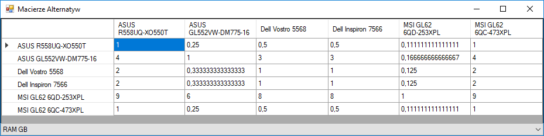
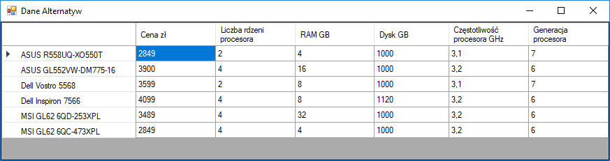
### Ekran wyników ###
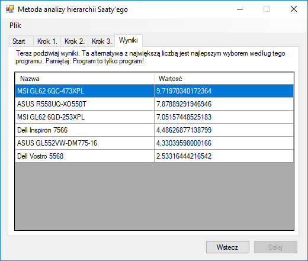